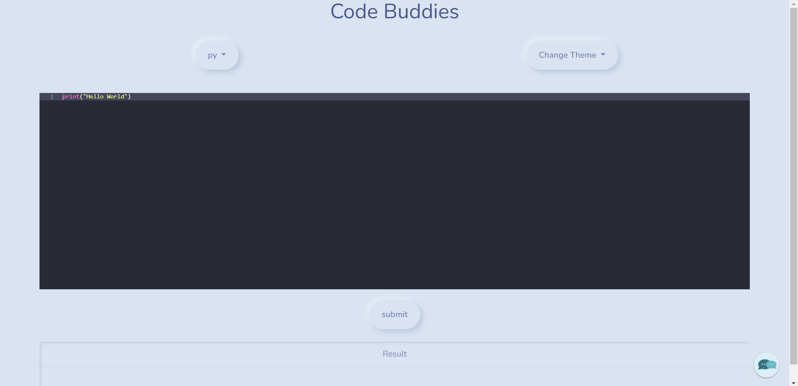
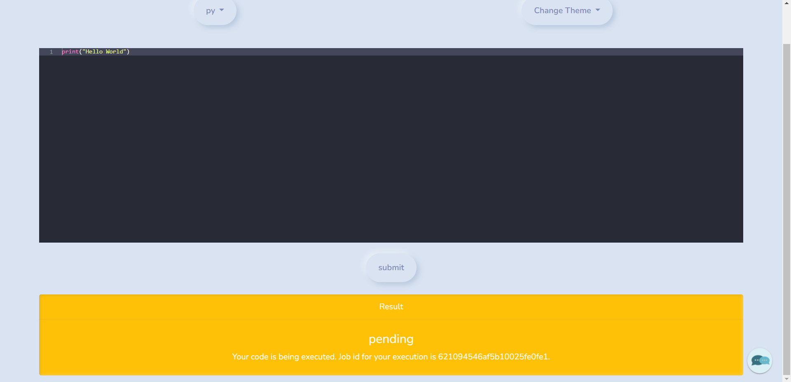
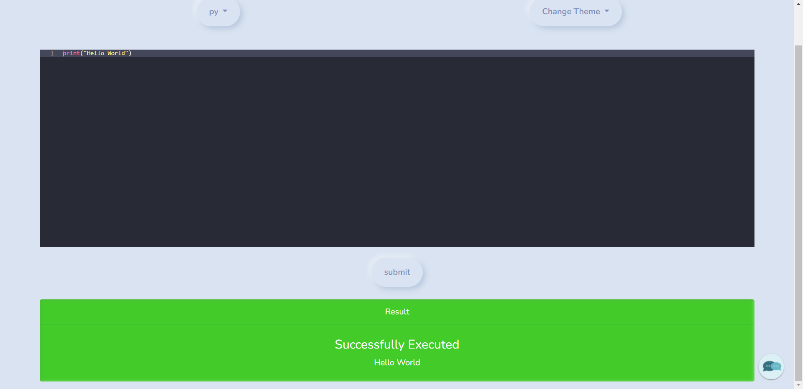
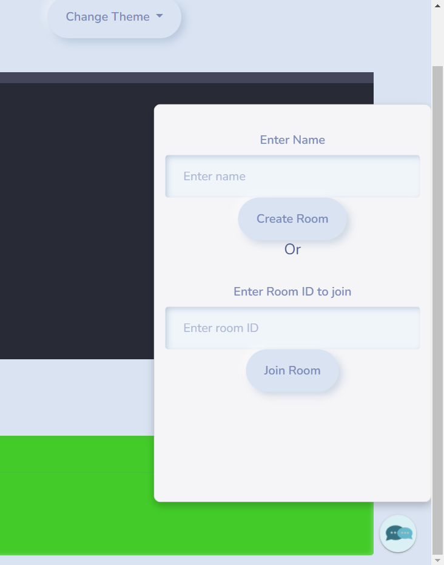
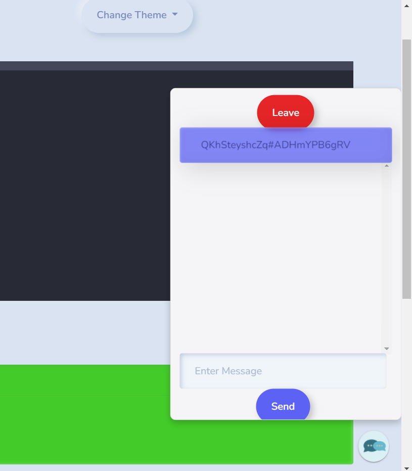
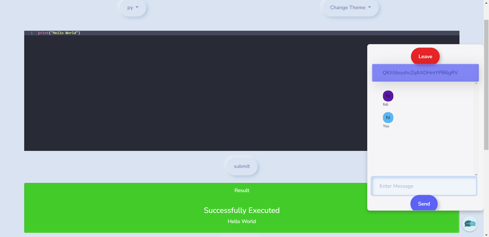
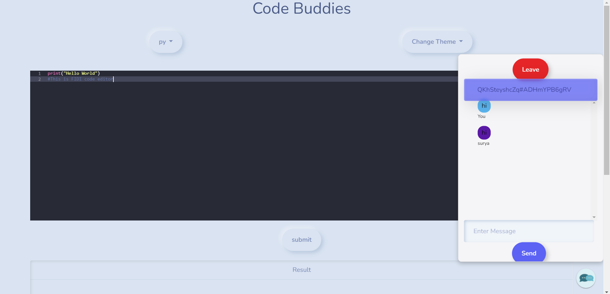
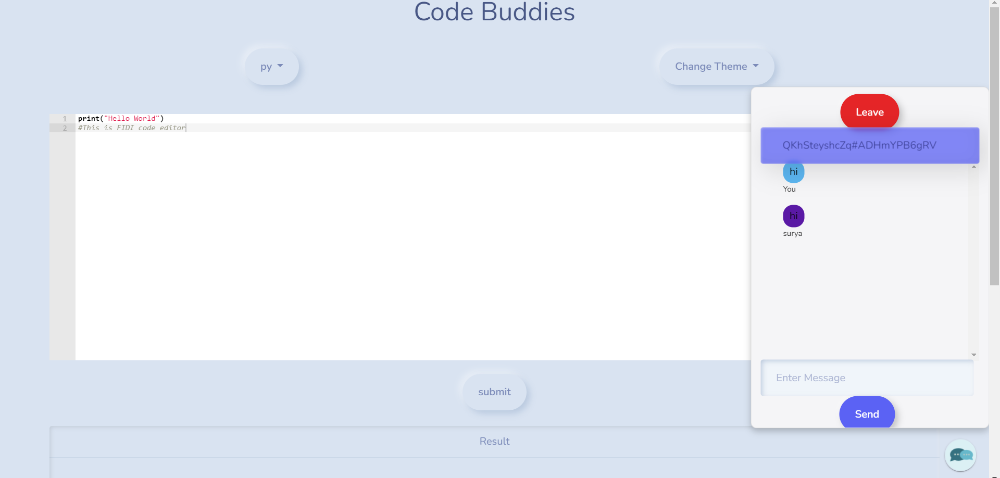
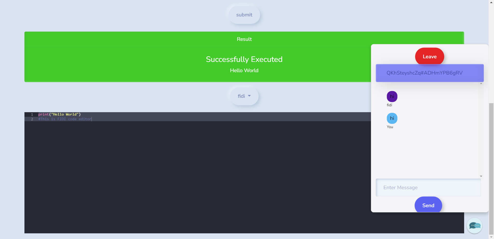

#CodeBuddies

Website is hosted [here](https://awesomecodebuddies.herokuapp.com/)

CPP is not available on hosted site because creation of cpp environment for nodejs app in heroku is not available.
A version using bull library was not deployed because usage of redis database on heroku is paid.

